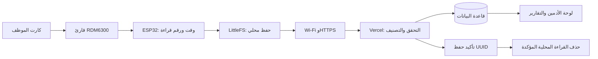

# تجهيز قارئ حضور لكل فرع

النظام المنشور: https://attendance-system-joe-2026.vercel.app/

## القرار النهائي — تشغيل مستمر بالكهرباء وWi‑Fi

وفق اختيارك يوم 4 أكتوبر 2026، يظل ESP32 والراوتر موصلين بالكهرباء طوال الوقت، حتى عند إغلاق المحل. النسخة الحالية تعمل **بدون DS3231 أو بطارية ساعة**؛ تحصل على وقت UTC من الإنترنت عبر NTP عند الإقلاع وتعيد مزامنته أثناء التشغيل. استمرار وجود شبكة Wi‑Fi لا يعني دائمًا وصول الإنترنت أو نجاح خدمة الوقت؛ لو الجهاز أعاد التشغيل دون وقت موثوق، يحفظ القراءات للمراجعة ولا يخمّن توقيتها.

قارئا الفرعين وهوياتهما موجودان بالفعل في النظام. إعدادات كل فرع الخاصة محفوظة محليًا في `C:\Users\abdol\AppData\Local\JoeStore\Attendance\ReaderConfigs\branch1.h` و`branch2.h`. تحتوي على مفتاح مختلف لكل قارئ؛ أدخل بيانات Wi‑Fi محليًا ولا تشارك هذه الملفات أو ترفعها إلى Git.

## القطع المختارة من لامبا

تمت مراجعة أسعار القطع الأساسية يوم 4 أكتوبر 2026. النسخة الجاهزة تستخدم **RFID ‏125kHz** وليست NFC ‏13.56MHz. لا تشترِ كروت MIFARE أو NTAG لهذا القارئ.

| القطعة | للفرع الواحد | للفرعين | سعر القطعة / العبوة |
|---|---:|---:|---:|
| [ESP32 ‏30-pin WiFi/Bluetooth](https://lampatronics.com/product/esp32-30pin-development-board-wifi-and-bluetooth) | 1 | 2 | 280 جنيه |
| [RDM6300 ‏125kHz](https://lampatronics.com/product/rdm6300-rfid-reader-module-125khz) | 1 | 2 | 160 جنيه |
| [كارت RFID ‏125kHz](https://lampatronics.com/product/rfid-card-125khz) | كارت لكل موظف | 5 للحسابات الحالية | 7 جنيه |
| [مقاومة 1kΩ ‏1/4W، عبوة قطعتين](https://lampatronics.com/product/resistor-1k-ohm-1-4w-2pcs) | 3 مقاومات | 3 عبوات = 6 مقاومات | 0.30 جنيه |

إجمالي القطع المذكورة للفرعين وخمسة موظفين **915.90 جنيه**، قبل الشحن ومستلزمات التغذية والتركيب. توفير 180 جنيه بحذف ساعتي DS3231، بجانب توفير شراء بطاريتيهما. لم يتم تنفيذ شراء أو دفع.

مستلزمات تركيب لازمة للفرعين، وأسعارها غير داخلة في الإجمالي:

- مصدران USB منظّمان 5V، بقدرة 1A أو أكثر لكل واحد. يمكن استعمال شاحنين موجودين مطابقين للمواصفات؛ ESP32 لا يسحب 1A باستمرار، هذه سعة المصدر المتاحة.
- كابلان USB يدعمان البيانات للبرمجة والتغذية، بمنفذ مطابق للبوردتين عند الاستلام.
- أسلاك توصيل قصيرة مناسبة للهيدرات، ولوحتا تجارب للتجربة الأولى أو لوحتا تثبيت ملحومتان للتركيب الدائم.
- علبتان لحماية التوصيلات، مع تثبيت هوائي كل قارئ خلف سطح غير معدني قريب من موضع تمرير الكارت.
- شبكة Wi‑Fi ‏2.4GHz في كل فرع، ووصول HTTPS على المنفذ 443 وخدمة NTP على UDP 123.

لا تحتاج كمبيوتر دائمًا أو بلوتوث أو شاشة أو بطاقة microSD أو وحدة GPS داخل القارئ. الكمبيوتر مطلوب مرة لبرمجة كل بوردة؛ GPS من هاتف الموظف. تخزين القراءات في فلاش ESP32. دعم التشغيل أثناء انقطاع الكهرباء نفسه يتطلب مصدرًا احتياطيًا، وهو خارج القائمة الحالية.

## التوصيلات لكل ESP32

افصل التغذية أثناء التركيب. وصل الهوائي المرفق بالقارئ في موضع ANT. استخدم أسماء الأطراف المطبوعة على الوحدة؛ ترتيب الهيدرات قد يختلف بين الدفعات.

| من | إلى |
|---|---|
| RDM6300 VCC | مصدر 5V على ESP32 (طرف 5V/VIN حسب البوردة) |
| RDM6300 GND | ESP32 GND |
| RDM6300 TX | مقاومة 1kΩ ثم عقدة GPIO16 |
| عقدة GPIO16 | مقاومتان 1kΩ على التوالي ثم GND (إجمالي 2kΩ) |

اترك RX للقارئ غير موصل؛ التطبيق يحتاج استلام أرقام الكروت فقط. مقسم الجهد يخفض TX ‏5V إلى نحو 3.33V. لا توصل إشارة 5V مباشرة إلى GPIO16. افحص خرج القارئ قبل التشغيل؛ هذه التوصيلة معدة لخرج TTL ‏5V. طرف VIN يختلف بين البوردات؛ تحقق أنه متصل بتغذية USB ‏5V، وليس طرف 3V3، قبل توصيل RDM6300. استخدم مصدر USB واحدًا لكل مجموعة، وأرضيًا مشتركًا.

```text
شاحن USB 5V ── كابل USB ── ESP32
                             5V/VIN ─────────── RDM6300 VCC
                             GND ────────────── RDM6300 GND

RDM6300 TX ──[1kΩ]──●──────── GPIO16 (RX2)
                    │
                  [1kΩ]
                    │
                  [1kΩ]
                    │
                   GND

هوائي القارئ المرفق ───────── RDM6300 ANT
```

المقاومات الثلاث لكل فرع: واحدة على خط الإشارة، واثنتان على التوالي بين نقطة GPIO16 والأرضي. لا توصل قارئَي الفرعين ببعض؛ كل مجموعة تصل مستقلة إلى الموقع.

## ما يحدث بالضبط من تشغيل الجهاز إلى التقرير

1. يبدأ ESP32، ويفتح طابور القراءات المحفوظ في LittleFS، ويتصل بشبكة الفرع.
2. يضبط الوقت من الإنترنت. ظهور `Clock synchronized from Internet` في Serial يعني أن التوقيت والرفع عبر HTTPS جاهزان. الانتظار لا يوقف استقبال الكروت؛ القراءات قبل ضبط الوقت تحتاج مراجعة.
3. الموظف يمرر الكارت على هوائي RDM6300؛ يصل رقم الكارت إلى GPIO16 عبر UART بسرعة 9600، ويتحقق الكود من سلامة إطار القراءة.
4. يلتقط ESP32 وقت UTC ورقم الكارت وUUID جديدًا، ويحفظها على الفلاش **قبل** محاولة رفعها. الاستمرار في الإمساك بالكارت أمام الهوائي لا يولّد قراءة كل جزء من الثانية.
5. مهمة الشبكة ترسل دفعات حتى 20 قراءة إلى `/api/nfc/events` على Vercel، عبر HTTPS ومفتاح القارئ الخاص. السيرفر يستنتج الفرع من هوية القارئ، ويربط الكارت بالموظف.
6. السيرفر يصنف القراءة وفق شيفت الموظف ونافذة الحضور أو الانصراف. القراءات خارج النافذة أو النوافذ المتداخلة أو الكروت غير المرتبطة تظهر للمراجعة؛ لا تُعتبر حضورًا عشوائيًا.
7. بعد تأكيد السيرفر حفظ كل UUID، يحذف ESP32 تلك القراءة من طابوره. الرد المفقود يعيد الإرسال بأمان، دون تكرار الحضور.
8. الأدمين يرى الوصول والانصراف والتأخير والإضافي، وتقارير اليوم/الأسبوع/الشهر أو الفترة المختارة. موقع الهاتف يوضح حركة الموظف أثناء الشيفت فقط.

القارئ يظل يعمل 24 ساعة؛ تمرير الكارت خارج نافذة الموظف محفوظ للمراجعة. تتبع هاتف الموظف مقيد بالشيفت، ويتوقف عند نهايته أو عند انصراف الكارت المسجل.



## برمجة البوردتين

1. استخدم ملف `branch1.h` للفرع الأساسي و`branch2.h` لفرع الجملة من المجلد الخاص المذكور أعلى الدليل؛ لا تنشئ قارئًا مكررًا. لو فقدت الملف، أصدر مفتاحًا بديلًا لهذا القارئ من لوحة الأدمين.
2. انسخ ملف الفرع المختار إلى `include/attendance-config.h`، ثم أدخل اسم شبكة Wi‑Fi ‏2.4GHz وكلمتها محليًا. ملف الإعداد الحقيقي مستبعد من Git. للتجهيز من البداية يوجد `include/config.example.h` كمثال فقط؛ بياناته الوهمية لا تصلح لتشغيل القارئ.
3. يوجد PlatformIO في `.tools/pio-runtime` داخل المشروع. من جذر المشروع:

```powershell
& ./.tools/pio-runtime/Scripts/python.exe -m platformio run -d firmware/esp32-reader
& ./.tools/pio-runtime/Scripts/python.exe -m platformio run -d firmware/esp32-reader -t upload --upload-port COM5
& ./.tools/pio-runtime/Scripts/python.exe -m platformio device monitor -d firmware/esp32-reader -p COM5
```

استبدل COM5 بمنفذ الجهاز الفعلي. الكمبيوتر مطلوب للبرمجة الأولى فقط؛ بعد ذلك يُغذّى ESP32 من شاحن USB ويعمل مستقلًا.

4. للجهاز **الجديد فقط**، إذا ظهرت `LittleFS unavailable` أرسل `--format` من Serial Monitor مرة واحدة. هذا أمر مسح التخزين؛ لا تستخدمه على جهاز عليه قراءات لم تُزامن.
5. انتظر ضبط الساعة عبر NTP قبل اعتماد أي قراءة حضور. الوقت UTC داخل الجهاز، والتحويل للقاهرة وتوقيت الصيف على السيرفر. بدون ساعة خارجية يحتاج كل إقلاع بارد لضبط الوقت من الشبكة.
6. استبدل `attendance-config.h` بملف الفرع الثاني، ثم **أعد البناء والرفع** للبورد الثانية. لا ترفع نفس الباينري المهيأ للفرع الأول على الاثنين؛ هوية الفرع ومفتاحه جزء من البناء.

## ربط الموظفين والاختبار الحقيقي

الكارت العادي EM4100 له رقم ثابت؛ **لا يحتاج كتابة اسم الموظف أو برمجة بيانات عليه**. الربط في قاعدة البيانات:

1. مرّر كارت الموظف. يظهر رقمه في Serial Monitor وفي **كل قراءات الكروت** على الموقع.
2. اضغط **استخدام رقم الكارت**، اختر الموظف واضغط **ربط الكارت**.
3. القراءة الأولى التي سبقت الربط تبقى للمراجعة. يمكن للأدمين اعتمادها مع السبب، أو استخدام قراءة جديدة بعد الربط.
4. اضبط بروفايل الموظف. مثال محل يفتح 12 ظهرًا ويغلق 12 ليلًا: شيفت 12:00–21:00 أو 15:00–00:00، كلاهما 9 ساعات. هذه أمثلة؛ مواعيد الحسابات الحالية لا تُغيّر تلقائيًا.
5. الافتراضي للحضور: من 60 دقيقة قبل البداية إلى 120 دقيقة بعدها. الانصراف: من 60 دقيقة قبل النهاية إلى 180 دقيقة بعدها. كلها قابلة للتعديل لكل موظف، مع تاريخ سريان.
6. مرّر الكارت قرب البداية والنهاية وتحقق من نوع القراءة والفرع ووقت الالتقاط على Vercel.
7. افصل وصول الإنترنت مع بقاء ESP32 يعمل، ثم مرّر الكارت وأعد الشبكة. تأكد على Vercel من وصول نفس وقت الالتقاط مرة واحدة، وليس وقت عودة الإنترنت.
8. للاختبار المنفصل: بعد حفظ قراءة معلومة الوقت دون شبكة، أعد تشغيل ESP32 مع استمرار الانقطاع ومرّر كارتًا آخر. عند رجوع الإنترنت يجب أن تصل القراءة القديمة بتوقيتها الأصلي، والثانية بوقت غير معلوم للمراجعة. تحقق أن إعادة التشغيل لم تمسح الطابور.
9. أعد ضبط الشبكة وشغّل الجهاز دون الكمبيوتر، من شاحن USB مستقل. اختبر الفرع الصحيح، ورفض إعادة الإرسال المكرر، وتصنيف الحضور والانصراف، والشيفت الذي يعبر منتصف الليل. لا تعطل شبكة المحل العامة وقت العمل؛ يمكن تعطيل نقطة اختبار أو وصول الجهاز للإنترنت مؤقتًا.

أرقام UID وحدها قابلة للاستنساخ في بعض أنواع الكروت؛ هذه النسخة لا تثبت أن حامل الكارت هو صاحبه. إذا احتجت مقاومة نسخ الكروت، يلزم قارئ وكروت تدعم تحققًا مشفرًا، وتعديل بروتوكول القراءة.

## السلوك عند انقطاع النت

- كل تمريرة لها UUID، وتُكتب إلى LittleFS قبل إظهار نجاح الحفظ.
- رفع الشبكة في مهمة مستقلة؛ قراءة UART مستمرة أثناء الاتصال. الخادم يستقبل حتى 100 حدث، والبرنامج يرسل دفعات 20.
- لا تُحذف القراءة محليًا حتى يؤكد السيرفر حفظ UUID. إعادة الإرسال لا تكرر الحضور.
- كل قراءة سليمة بروتوكوليًا محفوظة في `nfc_scans`، بما فيها غير المرتبطة وخارج النافذة والمتكررة والوقت غير المعلوم. القراءات المرفوضة بسبب انقطاع الاتصال أو مفتاح معطل تبقى بالجهاز للمحاولة لاحقًا.
- فقدان الوقت لا يحوله لوقت وصول الشبكة؛ يرفع `recorded_at=null` وتظهر القراءة للمراجعة.
- عند انقطاع النت دون إعادة تشغيل، يستمر توقيت النظام محليًا؛ قد ينجرف أثناء انقطاع طويل. عند إعادة تشغيل الجهاز دون نت لا يوجد تاريخ موثوق، فتحتاج القراءات الجديدة مراجعة. القراءات القديمة المخزنة تظل تحتفظ بتوقيت التقاطها.
- عند رجوع Wi‑Fi يعيد الاتصال تلقائيًا، ويحاول الرفع مجددًا. تعطل الموقع أو رفض المفتاح لا يمسح القراءات. حد التحقق التلقائي لقدم وقت القراءة على السيرفر 90 يومًا؛ الأقدم يُحفظ للمراجعة.
- التخزين محدود بمساحة الفلاش. وميض LED السريع و`NOT SAVED - STORAGE ERROR` يعني أن التمريرة **لم تُحفظ** وتحتاج إعادة تمرير بعد معالجة التخزين؛ لا تُعاملها كحضور مسجل.
- نوافذ متداخلة أو قراءة في منتصف الشيفت: مراجعة إدارية، لا تخمين حضور/انصراف. تعديل القراءة يحفظ السبب والأدمين والقيم السابقة والجديدة.

## مؤشرات الحالة

- وميض سريع (نحو 150ms لكل حالة): مشكلة تخزين؛ لا تعتمد القراءة حتى تظهر `SAVED` بعد معالجة المشكلة وإعادة تمرير الكارت.
- وميض بطيء (نحو 500ms لكل حالة): وقت الإنترنت لم يُضبط بعد؛ القراءات محفوظة للمراجعة.
- ومضة قصيرة عند كارت معلوم الوقت: تم الحفظ محليًا؛ التأكيد النهائي على الموقع أو برسالة `Server saved`.
- ومضة قصيرة كل ثانيتين مع وقت مضبوط: Wi‑Fi مفصول، والقراءات تتراكم محليًا.
- عدم الوميض في الحالة العادية ليس إثباتًا لوصول السيرفر؛ شاشة الأدمين وSerial هما وسيلة تأكيد الرفع. LED GPIO2 قد يختلف في بعض البوردات؛ عدّل `STATUS_LED` وفق البوردة.

## تتبع الهاتف وحساب الساعات

- الحضور والانصراف الأساسيان من الكارت. أزرار الهاتف تفعّل/توقف GPS فقط.
- GPS يعمل داخل أيام العمل ومواعيد الشيفت؛ يتوقف عند النهاية وعند وصول انصراف الكارت. السيرفر يرفض أيضًا العينات خارج تلك المدة.
- جدول 7 أيام يُحفظ على الهاتف لاستمرار الشيفت دون شبكة. عند انتهاء صلاحية الجدول يتوقف GPS إلى أن يُحدّث من السيرفر. التغييرات الإدارية أثناء انقطاع الشبكة تصل بعد رجوعها.
- Android يتابع المواعيد في خدمة ظاهرة للمستخدم. iPhone يحتاج فتح التطبيق وتفعيل المتابعة عند بداية الشيفت؛ لا توجد ضمانة لتشغيل تطبيق مغلق تلقائيًا كل يوم من نظام iOS.
- ساعات حضور الكارت المؤكدة تُعتمد عند وجود حضور وانصراف صالحين. عند نسيان الانصراف تُعرض ساعات مبدئية منفصلة، دون اختراع توقيت انصراف.
- وقت كل فرع والخروج والفجوات مستمد من عينات GPS داخل الشيفت، ويُعرض منفصلًا عن إجمالي مدة الكارت. فجوة GPS لا تلغي حضورًا مثبتًا بالكارت ولا تُنسب لفرع وهميًا. الإضافي بعد نهاية الشيفت محسوب من قراءة الانصراف بالكارت.

## التحقق المتاح

الفحوص الوظيفية تُشغّل على Vercel فقط بواسطة `scripts/verify-card-production.mjs`؛ تُنشئ موارد QA معزولة ثم تحذفها دون مساس بالحسابات الفعلية. نجح سابقًا 24 فحصًا على النسخة المنشورة، وبناء Android وiOS Simulator. بناء Firmware يثبت نجاح الترجمة فقط. لم يصل الهاردوير بعد، لذلك اختبارات الهوائي والأسلاك ومصدر التغذية ومزامنة الوقت وإعادة تشغيل القارئ أثناء انقطاع الشبكة تحتاج القطع الفعلية.

مراجع البروتوكول: [RDM630 UART specification](https://files.seeedstudio.com/wiki/125Khz_RFID_module-UART/res/RDM630-Spec.pdf)، [توقيت ESP32 ومزامنة SNTP](https://docs.espressif.com/projects/esp-idf/en/stable/esp32/api-reference/system/system_time.html)، وشهادات TLS من [Google Trust Services](https://pki.goog/roots.pem). `include/certs.h` يحتوي شهادات جذر عامة؛ التحقق من HTTPS مفعّل، ويُحدّث الملف إذا تغيرت سلسلة شهادات المضيف إلى جهة أخرى.
